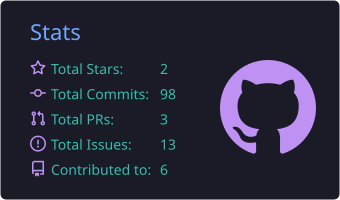
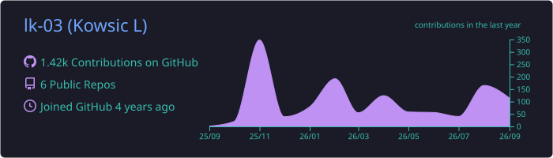

<!-- The Animated Waving Banner (Tokyonight Gradient) -->

 

<!-- Subtitle -->
<h3>Software Engineer | Full-Stack Developer | Mobile Architect</h3>

<!-- Tokyonight Custom Badges -->

  

**CS Undergrad @ VIT Chennai | Building resilient systems at scale**

 

---

### 👨‍💻 About Me

I love building robust, end-to-end software solutions that solve real-world problems. For me, it's not just about making a pretty interface—it's about writing clean code, designing scalable architectures, and building resilient systems from the ground up.

Right now, my main focus is on mastering full-stack engineering—from designing secure backend systems and APIs to connecting them with high-performance, cross-platform frontends!

---

### 🛠️ Skills & Arsenal

**Languages**  
TypeScript • JavaScript • Python • C/C++ • Java • SQL • Dart

**Frontend & Mobile**  
React • React Native • Expo • Flutter • Zustand

**Backend, Data & Core**  
Node.js • PostgreSQL • Supabase • REST APIs • Linux • Git

---

### 💻 Tech Stack

  

---

### 🔭 What I'm Currently Up To

- 💻 **Architecting Full-Stack Systems:** Building high-performance software with rock-solid data synchronization (like my FairShare app).
- 🚀 **Planning Lukatdis:** Designing the backend architecture and data flow for a personal stock monitoring dashboard.
- 🎯 **Expanding My Toolkit:** Broadening my cross-platform engineering skills by diving into **Flutter** and **Dart**! 💙

---

### 📈 GitHub Stats & Activity

  

  

  

